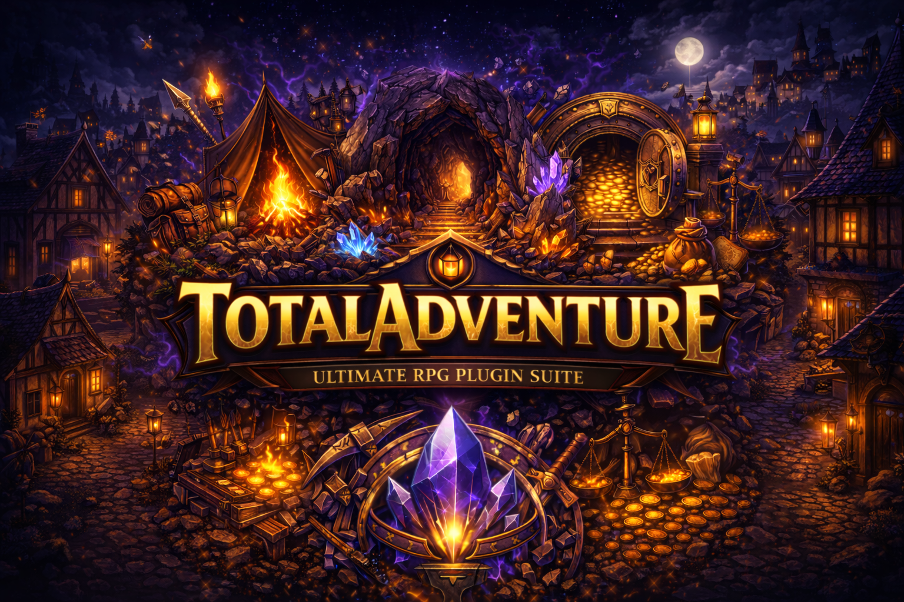

  

  <b>Um RPG de mineração onde decisões importam.</b> 
  Progressão real • Economia local • Risco permanente

---

## 🧭 Bem-vindo ao TotalAdventure

**TotalAdventure** é um projeto de RPG e mineração para Minecraft,
focado em **progressão real**, **risco significativo** e **economia localizada**.

Aqui não existe:
- teleporte conveniente
- progresso automático
- poder sem custo

Existe **um mundo hostil**,  
**uma picareta**,  
e **decisões que deixam marcas**.

---

## 🧠 O que é o TotalAdventure?

TotalAdventure é um jogo onde:

- o mundo não gira em torno do jogador  
- progresso exige deslocamento  
- poder cobra um preço  
- erro ensina  

Você não é o herói escolhido.  
Você é apenas mais um aventureiro tentando **sobreviver, evoluir e não perder tudo no processo**.

---

## 🔁 O loop central do jogo

Tudo no TotalAdventure existe para sustentar um único ciclo:

> **Nascer na vila → minerar → lutar → forjar → arriscar → evoluir**

Você começa fraco.  
Explora cavernas perigosas.  
Enfrenta mobs escaláveis.  
Coleta recursos raros.  
E volta para a vila para decidir **quanto risco está disposto a assumir**.

Nada vem pronto.  
Tudo é conquistado.

➡️ **[O Loop do Jogo](core-concepts/game-loop.md)**

---

## 🌍 O mundo e suas regras

O mundo não se adapta a você.  
Você se adapta a ele.

Não existe:
- economia global
- acesso instantâneo
- progressão linear garantida

Mover-se pelo mapa **é parte da progressão**.  
Escolher onde ir **é parte do risco**.

---

## ⛏️ Mineração com progressão real

Mineração não é um meio.
É um **limitador de mundo**.

- Picaretas possuem **tiers**
- Blocos exigem tier mínimo
- Blocos têm vida e resistem ao dano
- Minérios dropam por **chance**
- Sorte e modificadores importam
- Tudo segue **raridade**:
  - Comum
  - Raro
  - Épico
  - Lendário

Quanto mais fundo você vai,
mais o mundo tenta te impedir.

➡️ **[Sistema de Mineração](mining/overview.md)**

---

## 🔥 Forja, bigorna e o risco final

Forjar não é clicar.
É decidir.

O processo envolve:
- combinar minérios na **forja**
- respeitar peso e limites
- moldar o item na **bigorna**
- arriscar tudo no **caldeirão**

⚠️ **Falhou no caldeirão?**  
O item é perdido.  
Definitivamente.

Aqui, poder exige coragem.

➡️ **[Forja e Risco](forging/overview.md)**

---

## 🧬 Equipamentos, atributos e traits

Itens forjados nunca são iguais.

Eles podem possuir:
- atributos aleatórios
- raridade visível
- escalonamento por qualidade
- **traits lendários** raros

Traits não são encantamentos.
São **habilidades únicas**, com identidade,
efeitos visuais e impacto real.

Cada item lendário conta uma história.
Nem todas terminam bem.

➡️ **[Equipamentos e Traits](equipment/overview.md)**

---

## 🧟 Combate, mobs e perigo real

Mobs no TotalAdventure não são obstáculos descartáveis.

Eles:
- possuem level
- escalam atributos
- usam equipamentos
- ativam skills
- reagem a eventos
- punem descuido

Aqui, combate não é reflexo.
É leitura, planejamento e consequência.

➡️ **[Mobs e Combate](mobs/overview.md)**

---

## 💰 Economia local e bancos físicos

O dinheiro não é abstrato.
Ele pesa.

- Moedas são físicas
- Drops e vendas geram dinheiro no inventário
- Para usar dinheiro, é preciso **depositar em um banco**
- Cada vila possui seu próprio banco
- Dinheiro não viaja livremente

> Poder econômico é regional.  
> O mundo importa.

➡️ **[Economia](economy/overview.md)**

---

## 👥 Multiplayer sem proteção artificial

O jogo não força PvP.  
Mas também não protege contra más decisões.

- Minérios dropam no chão
- Jogadores podem trocar itens
- Picaretas são pessoais e travadas
- Oportunismo existe

Confiança é escolha.
Consequência também.

---

## 🧭 Filosofia, visão e direção

Algumas decisões são intencionais:

- não há teleporte livre
- não há economia global
- não há progresso automático
- não há poder sem custo

Isso não é limitação técnica.
É **filosofia de design**.

➡️ **[Filosofia de Design](design-philosophy.md)**  
➡️ **[Roadmap](roadmap.md)**

---

## 👤 Sobre o projeto

TotalAdventure é um projeto autoral,
desenvolvido com foco em:

- sistemas interligados
- coerência de mundo
- progressão significativa
- evolução a longo prazo

➡️ **[Sobre o Criador](creator.md)**

---

## 📚 Por onde começar?

Se você é novo no projeto, siga esta ordem:

1. **[O Loop do Jogo](core-concepts/game-loop.md)**
2. **[Mineração](mining/overview.md)**
3. **[Forja](forging/overview.md)**
4. **[Mobs e Combate](mobs/overview.md)**
5. **[Economia](economy/overview.md)**

---

## 🛠️ Estado do projeto

TotalAdventure está em desenvolvimento ativo.

Sistemas evoluem.  
Números mudam.  
Ideias amadurecem.

A documentação acompanha essa evolução.

> Nada aqui é definitivo.  
> Exceto as consequências das suas decisões no caldeirão.
